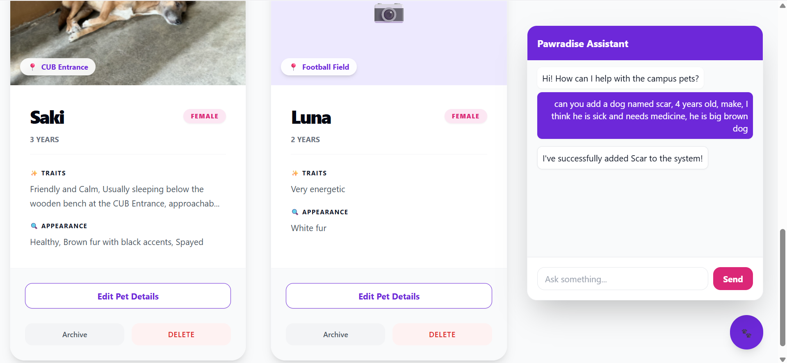
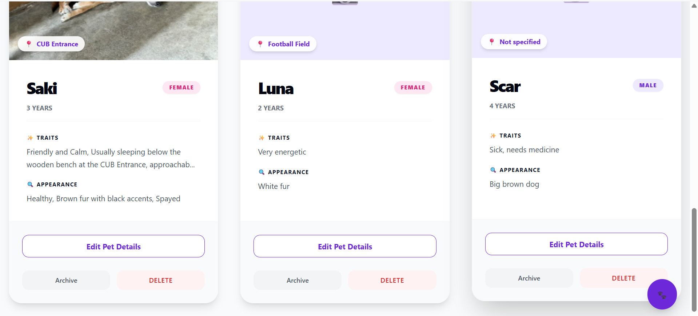

# 🐾 Project Pawradise: Campus Pet Inventory

**Project Pawaradise** is a web-based inventory system built with Laravel to track and manage community-owned pets (cats/dogs) found around a university campus. It allows users to document pet locations, physical traits, and personalities to ensure their well-being and visibility within the campus community.

---

## 🚀 Features

* **Full CRUD Lifecycle:** Create, Read, Update, and Archive pet records seamlessly.
* **Intelligent Archiving:** Utilizes Laravel **Soft Deletes** to hide pets from the main inventory without losing historical data or records.
* **Image Processing:** A dedicated **Service Layer** for handling high-quality pet photo uploads, ensuring clean storage management.
* **Responsive UI:** A modern, "Paw-themed" interface built with **Tailwind CSS** and reusable **Blade Components**.
* **AI-Powered Chatbot:** A natural language interface to manage your inventory through conversation.

---

## 🛠️ Installation & Setup

### 1. Prerequisites
* **PHP 8.2+**
* **Composer**
* **Node.js & NPM**
* **PostgreSQL**

### 2. Clone and Install
```bash
# Clone the repository
git clone <your-repo-link>
cd pet-inventory

# Install PHP dependencies
composer install

# Install JS dependencies
npm install && npm run dev
```

### 3. Database Setup (PostgreSQL)
1. Open your PostgreSQL terminal or a tool like pgAdmin.

2. Create a new database:
```bash
CREATE DATABASE pawradise_db;
```

3. Copy the environment file:
```bash
cp .env.example .env
```
4. Update your .env with your local credentials:
```bash
DB_CONNECTION=pgsql
DB_HOST=127.0.0.1
DB_PORT=5432
DB_DATABASE=pawradise_db
DB_USERNAME=your_username
DB_PASSWORD=your_password
```

### 4. Migrations & Storage
```bash
# Run database migrations
php artisan migrate

# IMPORTANT: Link the storage folder to make images accessible via web
php artisan storage:link

# Start the local development server
php artisan serve
```

## 🏗️ MVC Architecture & Structure

This project strictly follows the Model-View-Controller (MVC) pattern, supplemented by a Service Layer to maintain "Skinny Controllers" and "Fat Models/Services."
### Project Structure
```bash
pet-inventory/
├── app/
│   ├── Http/Controllers/
│   │   └── PetController.php      <-- [CONTROLLER] Brain of the app; handles requests and flow.
│   ├── Models/
│   │   └── Pet.php                <-- [MODEL] Database logic, fillables, and SoftDeletes.
│   └── Services/
│       └── PetImageService.php    <-- [SERVICE] Isolated logic for file uploads and deletions.
├── database/
│   └── migrations/                <-- [DATABASE] Defines the PostgreSQL table schema.
├── resources/
│   └── views/                     <-- [VIEW] The UI Layer
│       ├── layouts/               <-- Master Blade templates (Navigation, Global CSS).
│       ├── components/            <-- Reusable UI pieces (Pet Cards, Add-Pet Modals).
│       └── pets/                  <-- Specific page views (Index, Edit, Archive).
├── routes/
│   └── web.php                    <-- The "Route Map" defining all accessible URLs.
└── public/
    └── storage/                   <-- Symbolic link to access uploaded pet photos.
```


## 🤖 New: Pawaradise AI Assistant (GenAI Integration)

Project Pawaradise now features an **Intelligent Chatbot Assistant** that acts as a natural language interface for your database. Instead of manually clicking through forms, you can simply "talk" to the inventory.

### 🌟 AI Capabilities
* **Natural Language CRUD:** Add, update, archive, or restore pets using conversational English.
* **Multi-Tasking:** Give complex instructions like *"Update Goldy's age to 5 and archive Shadow"* in a single message.
* **Context Awareness:** The AI "sees" your current database state and can answer questions about specific pets.
* **Dual-Provider Reliability:** Built with a **Primary (Gemini 1.5/3.1)** and **Fallback (Groq/Llama 3.3)** architecture to ensure 100% uptime.
* **Safety First:** The AI is programmed to ask for confirmation before any permanent deletions or archiving.

### 💬 Example Commands
* *"Add a new male cat named Simba. He's 2 years old, orange, and very friendly."*
* *"I saw Luna at the Engineering building this morning, please update her location."*
* *"Restore the record for Goldy from the archive."*
* *"Permanently delete the test record for 'Unknown Dog'."*

---

## ⚙️ AI Configuration & Architecture

The AI features are powered by a dedicated **Service Layer** pattern to keep the logic decoupled from your Laravel controllers.

### 1. Environment Setup
Add your API keys to the `.env` file:
```env
# AI Provider Settings
AI_PRIMARY_PROVIDER=gemini
AI_FALLBACK_PROVIDER=groq

# API Keys
GEMINI_API_KEY=your_google_gemini_key
GEMINI_MODEL=gemini-1.5-flash

GROQ_API_KEY=your_groq_key
GROQ_MODEL=llama-3.3-70b-versatile
```

### 🗨️ Conversational & Informational Prompts
*Use these to test how the AI handles the "Database Context" and its natural personality.*

1. "Who are the oldest pets currently living on campus?"
2. "I'm looking for a friendly cat to visit near the Engineering building, do you have any suggestions?"
3. "Can you give me a summary of all the pets currently in the system?"
4. "What are the common traits of the dogs found around the University Library?"
5. "Tell me more about Goldy. What does she look like and where is she usually seen?"

---

### 🛠️ CRUD & Action-Oriented Prompts
*Use these to test the regex command parsing and the batch execution logic.*

1. **Create:** "I found a new pet! Her name is Luna, she's a 1-year-old female dog with white fur. She's usually seen near the Football Field and is very energetic."
2. **Update:** "I just saw Simba again. He looks a bit older now, can you change his age to 3 and add 'loves treats' to his traits?"
3. **Archive (Soft Delete):** "It looks like Shadow has been adopted by a local family and is no longer on campus. Please move his record to the archive."
4. **Restore:** "Wait, I actually spotted Shadow back near the dorms today. Can you restore his record from the archive?"
5. **Multi-Task (Chained Commands):** "Update Goldy's location to the 'Science Lab' and also permanently delete that 'Test Pet' record I made earlier."

## 📸 Application Screenshots

Here is a visual overview of the Project Pawradise interface.

### Active Inventory (Dashboard)
This screen shows all currently active pets on campus. You can view their quick details, edit their profiles, or move them to the archive.


### Archived Records
This view displays pets that have been soft-deleted. From here, records can be restored back to the active inventory or permanently removed from the system.


### AI Interaction
This shows the interaction with the chatbot.



